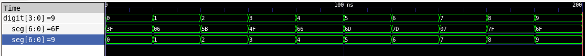
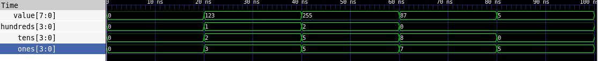
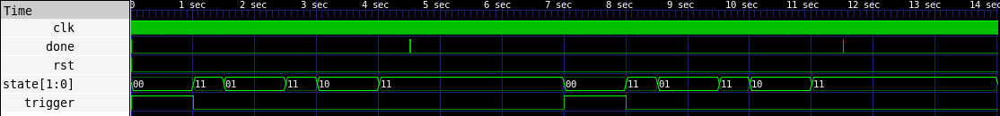
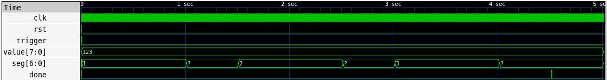
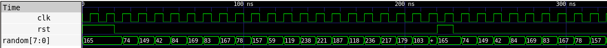
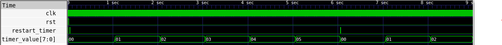
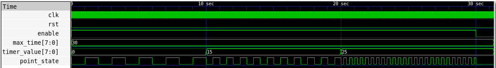
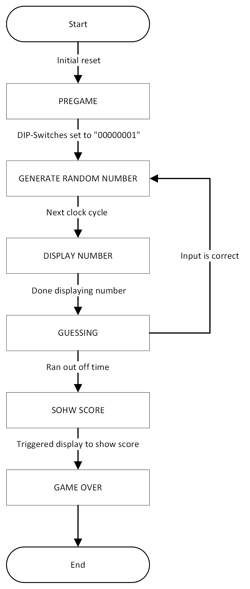
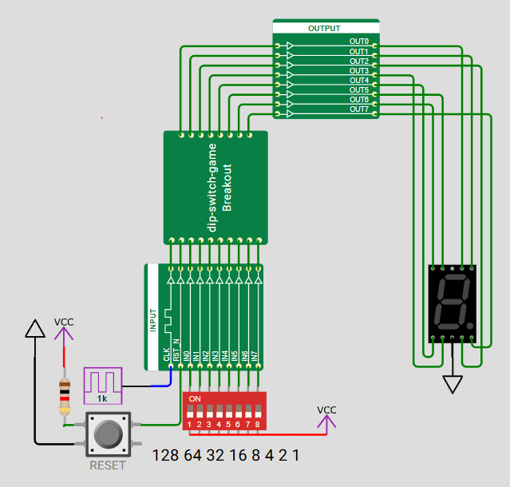

# 📝Preamble

This is my first participation in Tiny Tapeout. I discovered Tiny Tapeout when I came across the lecture *“KV Entwurf Integrierter Schaltungen”* while looking for courses to complete some additional ECTS credits during my master’s studies at JKU Linz.

IC design is a completely new field for me, as I am actually studying Mechatronics with a focus on electrical machines and power electronics. Even though I had little knowledge about digital circuit design and no prior experience with Hardware Description Languages (HDLs), I was immediately fascinated by the concept of Tiny Tapeout. That’s why I decided to take this course and participate in Tiny Tapeout.

This document serves both as the [GitHub documentation](https://github.com/TobiasPfaffeneder/tt-sky25b-can-you-count-binary-game/blob/main/docs/info.md) for my project and as the report for the lecture. Depending on where you are reading this, some sections may therefore appear slightly over-explained.

# 💡 The Project Idea

## Project Restrictions

After receiving an initial introduction to Tiny Tapeout during the workshop on 24.09.2025 at JKU, the next challenge was to come up with a project idea.  
In the lecture, we were relatively free to choose a project we wanted to work on. The only requirements were that it had to comply with the specifications provided by TinyTapeout ([TinyTapeout – Specs](https://tinytapeout.com/specs/)) and that it should be interesting enough to form the basis of a report with a minimum length of 20 pages.

The specifications provided by TinyTapeout are summarized in the following table:

| **Specification**         | **Value**                |
|:------------------------- |:------------------------ |
| Circuit Complexity        | approx. 1000 logic gates |
| Clock Frequency           | adjustable max. 66 MHz   |
| Digital Inputs            | 8                        |
| Digital Outputs           | 8                        |
| Switchable Inputs/Outputs | 8                        |
| Analog Inputs/Outputs     | 6                        |
| PMOD PCBs                 | USB, VGA, PS/2, ...      |

While specifications such as the number of inputs and outputs or the adjustable clock frequency were clear, I had almost no intuition about how large a project with approximately 1000 logic gates could be. For a rough estimation, I looked through older Tiny Tapeout projects.

## Project: Can You Count Binary?

Taking these challenges into account, I decided that my project should be a simple game that can be played directly on the TinyTapeout PCB without requiring any additional hardware. The idea behind using only the integrated peripherals was to make testing straightforward and to encourage more people to try the game.

The following picture shows the PCB that is used since TinyTapeout 4. 

 

The PCB features 8 DIP switches connected to the digital inputs and a seven-segment display connected to the digital outputs. The bidirectional I/O pins as well as the analog I/Os remain unused in this project.  
Given these limited peripherals, the range of possible game concepts was already quite restricted. The game idea I developed works as follows:

- A random 8-bit decimal number is displayed digit by digit on the seven-segment display.

- The player must convert this number into its binary representation and enter it using the DIP switches. The player has only a limited amount of time for this.

- If the correct binary value is entered within the time limit, a new number is shown; otherwise, the game ends and the player's score is displayed.

- To increase the difficulty, the available time decreases as the score increases.

# ⚙️ Top-Level I/O

Defining the top-level I/O was fairly straightforward, as the standard peripherals included on the PCB are used.  
The only parameter that needed to be chosen was the clock frequency. Since the design does not require high-speed inputs or precise timing, a relatively slow clock frequency of 1 kHz was selected.

The PCB also features a reset button. It is normally pulled high and goes to GND when pressed. The modules implemented later in the design are therefore expected to perform a reset when this signal is low.

| Signal        | Dir | W   | Description                                |
| ------------- | --- | --- | ------------------------------------------ |
| `ui_in[7:0]`  | in  | 8   | **DIP switches** (player input)            |
| `uo_out[7:0]` | out | 8   | **Seven-segment display** (parallel 8-bit) |
| `uio_in[7:0]` | in  | 8   | Unused                                     |
| `clk`         | in  | 1   | System clock (1 kHz)                       |
| `rst_n`       | in  | 1   | Asynchronous reset (active-low)            |
| `ena`         | in  | 1   | Always `1` on Tiny Tapeout                 |

# 🔌 External hardware

No external hardware is required.

# 👨🏻‍💻 Implementation

## Used Tools

For the development of the project the [IIC-OSIC-TOOLS](https://github.com/iic-jku/IIC-OSIC-TOOLS) were used. The IIC-OSIC-TOOLS are an all-in-one Docker/Podman container for open-source-based integrated circuit designs for analog and digital circuit flows. They were created and are maintained by the [Department for Integrated Circuits (ICD), Johannes Kepler University (JKU)](https://iic.j**ku.a**t/). 

The hardware description language used within the IIC-OSIC-TOOLS is *Verilog*. The toolset includes various software components that support a smooth workflow when developing Verilog modules. The most relevant tools used in this project include:

- **Verilator** – Verilog code linter

- **Icarus Verilog** – Verilog compiler and simulator

- **GTKWave** – Waveform viewer

- **YOSYS / ABC** – Verilog synthesis toolchain

- **Magic** – Layout editor

- **LibreLane** – Digital RTL-to-GDS flow

Additionally, several provided shell scripts automate common workflows and simplify the development process.

For writing the Verilog code, [Visual Studio Code](https://code.visualstudio.com/) was used together with the [Verilog HDL](https://marketplace.visualstudio.com/items?itemName=leafvmaple.verilog) extension, which offers syntax highlighting, helpful code snippets, and other useful features.

## Modules

To simplify the development process, the project was divided into several smaller components, each implemented as an individual *Verilog* module. I first focused on the simplest modules to gain initial experience with Verilog before moving on to the more challenging ones.

In addition to the modules themselves, a dedicated testbench was developed for each module. A testbench provides the ability to apply a sequence of input signals to a module and observe its outputs in a waveform viewer such as *GTKWave*. This approach significantly improves debugging and verification during development. 

### sevenseg_decoder

#### Description

The **sevenseg_decoder** is a simple module that receives a digit as a 4-bit input and decodes it for display on the seven-segment display. The output is stored in a 7-bit register. The point of the display is not used in this module.  
The decoding is implemented using a `case` statement. If the input does not represent a valid digit, the display remains dark (default case).

#### Signal Overview

| Direction | Type       | Name  | Description                                          |
| --------- | ---------- | ----- | ---------------------------------------------------- |
| Input     | wire [3:0] | digit | 4-bit input value representing a decimal digit (0–9) |
| Output    | reg [6:0]  | seg   | 7-segment output pattern (segments a–g, active high) |

#### Verilog Code

```verilog
module sevenseg_decoder (
    input wire [3:0] digit,
    output reg [6:0] seg
);
    always @(*) begin
        case (digit)
            4'd0: seg = 7'b0111111;
            4'd1: seg = 7'b0000110;
            4'd2: seg = 7'b1011011;
            4'd3: seg = 7'b1001111;
            4'd4: seg = 7'b1100110;
            4'd5: seg = 7'b1101101;
            4'd6: seg = 7'b1111101;
            4'd7: seg = 7'b0000111;
            4'd8: seg = 7'b1111111;
            4'd9: seg = 7'b1101111;
            default: seg = 7'b0000000;
        endcase
    end
endmodule
```

#### Testbench

To test the module, a dedicated testbench was written that applies all digits sequentially as input. The results of the simulation were inspected in GTKWave.  
The input is displayed in decimal form, while the output appears both in binary and through a *Translate Filter Process* as the decoded decimal digit reconstructed from the segment pattern.



The *Translate Filter Process* is a simple pyhton script:

```python
#!/usr/bin/env python3
import sys

def transform(value):
    # 7-Segment Mapping
    seg7_map = {
        0x3F: "0",
        0x06: "1", 
        0x5B: "2",
        0x4F: "3",
        0x66: "4",
        0x6D: "5",
        0x7D: "6",
        0x07: "7",
        0x7F: "8",
        0x6F: "9",
    }

    try:
        # Hex-String zu Integer konvertieren
        if value.startswith('0x'):
            int_val = int(value, 16)
        else:
            # Falls ohne 0x-Präfix
            int_val = int(value, 16) if all(c in '0123456789ABCDEF' for c in value) else int(value)

        # Übersetzung
        return seg7_map.get(int_val, "?")

    except (ValueError, TypeError):
        return "?"

def main():
    fh_in = sys.stdin
    fh_out = sys.stdout

    while True:
        # incoming values have newline
        l = fh_in.readline().strip()
        if not l:
            return 0

        # outgoing filtered values must have a newline
        filtered_value = transform(l)
        fh_out.write("%s\n" % filtered_value)
        fh_out.flush()

if __name__ == '__main__':
    sys.exit(main())
```

### bcd_spliter

#### Description

The **bcd_splitter** module separates an 8-bit binary-coded decimal value (0 to 255) into its hundreds, tens, and ones digits. To extract the individual digits, division and modulo operations are used. If the number does not contain a hundreds or tens digit, the corresponding output is set to zero.

Although each calculated digit requires only 4 bits, the division and modulo results must first be assigned to an 8-bit wire. Directly slicing the result results in a compilation error. The values are therefore stored in intermediate 8-bit wires, from which only the lower 4 bits are forwarded to the outputs. The unused upper bits produce linter warnings, which can safely be ignored.

#### Signal Overview

| Direction | Type       | Name          | Description                                            |
| --------- | ---------- | ------------- | ------------------------------------------------------ |
| Input     | wire [7:0] | value         | Unsigned 8-bit input value to be split into BCD digits |
| Output    | wire [3:0] | hundreds      | Hundreds digit in BCD format                           |
| Output    | wire [3:0] | tens          | Tens digit in BCD format                               |
| Output    | wire [3:0] | ones          | Ones digit in BCD format                               |
| Internal  | wire [7:0] | hundreds_full | Intermediate result of value divided by 100            |
| Internal  | wire [7:0] | tens_full     | Intermediate result of (value / 10) modulo 10          |
| Internal  | wire [7:0] | ones_full     | Intermediate result of value modulo 10                 |

#### Code

```verilog
module bcd_splitter (
    input wire [7:0] value,
    output wire [3:0] hundreds,
    output wire [3:0] tens,
    output wire [3:0] ones
);
    // xxxx_full wires are required because for example "hundreds = (value / 8'd100)[3:0]" leads to an error (Linter warnings can be ignored)
    wire [7:0] hundreds_full = value / 8'd100;
    wire [7:0] tens_full = (value / 8'd10) % 8'd10;
    wire [7:0] ones_full = value % 8'd10;

    assign hundreds = hundreds_full[3:0];
    assign tens = tens_full[3:0];
    assign ones = ones_full[3:0];
endmodule
```

#### Testbench

In the testbench for this module, several random values are applied as inputs. The resulting outputs are then inspected using *GTKWave*.



### digit_selector

#### Description

The **digit_selector** module is responsible for determining which digit should be displayed at a given moment in order to represent a three-digit number on a single seven-segment display. Since the hardware can show only one digit at a time, multiplexing is required.  
The chosen solution is to display the hundreds, tens, and ones digits sequentially, each for a short period of time. A brief pause between digits is necessar. Without this pause, numbers such as *111* would appear as if the program had frozen, because the display output would not visibly change.
For numbers with fewer than three digits, leading zeros are displayed. For example, the number *3* is shown as 0 – 0 – 3.

The module operates as follows:  
When a high pulse is detected on the `trigger` signal, the `state` is set to 0 (hundreds digit) and an internal counter starts incrementing. Once the counter reaches `DISPLAY_TIME`, the `state` transitions to 3 (pause, display off). When the counter then reaches `PAUSE_TIME`, the `state` is set to 1(tens digit), and the sequence continues accordingly.

After all digits have been displayed, a short high pulse is asserted on the `done` signal.

The timing parameters are chosen such that each digit is displayed for 1 second, while the pause between digits lasts 0.5 seconds.

#### Signal Overview

| Direction | Type       | Name         | Description                                                                |
| --------- | ---------- | ------------ | -------------------------------------------------------------------------- |
| Input     | wire       | clk          | System clock                                                               |
| Input     | wire       | rst          | Active-high synchronous reset                                              |
| Input     | wire       | trigger      | Starts the digit selection sequence                                        |
| Output    | reg [1:0]  | state        | Currently active digit index (0 = hundrets, 1 = tens, 2 = ones, 3 = pause) |
| Output    | reg        | done         | Asserted for one clock cycle when the sequence is finished                 |
| Internal  | reg [10:0] | counter      | Time counter for display and pause intervals                               |
| Internal  | reg        | pause        | Indicates pause phase between digit displays                               |
| Internal  | reg        | active       | Indicates that the digit selection sequence is running                     |
| Internal  | reg [1:0]  | digit        | Current digit counter (0–2)                                                |
| Internal  | localparam | DISPLAY_TIME | Number of clock cycles a digit is displayed (1000 = 1 sec)                 |
| Internal  | localparam | PAUSE_TIME   | Number of clock cycles for the pause between digits (500 = 0.5 sec)        |

#### Verilog Code

```verilog
module digit_selector (
    input wire clk,
    input wire rst,
    input wire trigger,
    output reg [1:0] state = 2'b11,
    output reg done  = 1'b0
);

    reg [10:0] counter = 0;
    reg pause = 0;
    reg active = 0;
    reg [1:0] digit = 0;

    localparam DISPLAY_TIME = 1000; // 1 second
    localparam PAUSE_TIME = 500;  // 0.5 seconds

    always @(posedge clk or posedge rst) begin
        if (rst) begin
            counter <= 0;
            pause <= 0;
            active <= 0;
            digit <= 0;
            state <= 2'b11;
            done <= 1'b0;
        end else begin
            done <= 1'b0;

            if (!active) begin
                if (trigger) begin
                    active <= 1;
                    pause <= 0;
                    digit <= 0;
                    state <= 2'b00;
                    counter <= 0;
                end
            end else begin
                counter <= counter + 1;

                if ((!pause && counter >= DISPLAY_TIME) || 
                    (pause && counter >= PAUSE_TIME)) begin
                    counter <= 0;

                    if (!pause) begin
                        pause <= 1;
                        state <= 2'b11;
                    end else begin
                        pause <= 0;
                        if (digit == 2) begin
                            active <= 0;
                            state <= 2'b11;
                            done <= 1'b1;
                        end else begin
                            digit <= digit + 1;
                            state <= digit + 1;
                        end
                    end
                end
            end
        end
    end
endmodule
```

#### Testbench

In the testbench for this module, a reset is applied first, followed by two trigger signals separated by a time interval of 6 seconds. The resulting outputs are then inspected using GTKWave.  
As expected, the hundreds digit (*00*), the tens digit (*01*), and the ones digit (*10*) are displayed sequentially, with a pause state (*11*) in between. After all digits have been shown, followed by one additional pause, the `done` signal is asserted for a short period of time.



### sevenseg_display_controller

#### Description

The **sevenseg_display_controller** serves as the top-level module that integrates the three previously described modules. It receives an 8-bit `value` to be displayed and a `trigger` signal as inputs.

Inside the module, one instance each of the **bcd_splitter**, **digit_selector**, and **sevenseg_decoder** is instantiated. Several internal wires and registers are used to connect these submodules and manage the flow of control and data signals.

In essence, the module displays the given `value` on the seven-segment display whenever a high pulse is applied to the `trigger` signal. Once the entire number has been displayed, a short high pulse is asserted on the `done` signal.

#### Signal Overview

| Direction | Type             | Name          | Description                                             |
| --------- | ---------------- | ------------- | ------------------------------------------------------- |
| Input     | wire             | clk           | System clock                                            |
| Input     | wire             | rst           | Active-high synchronous reset                           |
| Input     | wire             | trigger       | Starts the display sequence                             |
| Input     | wire [7:0]       | value         | 8-bit value to be displayed on the 7-segment display    |
| Output    | wire [6:0]       | seg           | 7-segment output pattern (segments a–g)                 |
| Output    | wire             | done          | Asserted when the complete display sequence is finished |
| Internal  | wire [1:0]       | state         | Current digit selection state from digit selector       |
| Internal  | wire [3:0]       | hundreds      | Hundreds BCD digit from BCD splitter                    |
| Internal  | wire [3:0]       | tens          | Tens BCD digit from BCD splitter                        |
| Internal  | wire [3:0]       | ones          | Ones BCD digit from BCD splitter                        |
| Internal  | reg [3:0]        | current_digit | Currently selected digit forwarded to the decoder       |
| Internal  | localparam [3:0] | DISPLAY_OFF   | Special digit value to turn all segments off            |

#### Verilog Code

```verilog
`include "bcd_splitter.v"
`include "digit_selector.v"
`include "sevenseg_decoder.v"

module sevenseg_display_controller(
    input wire clk,
    input wire rst,
    input wire trigger,
    input wire [7:0] value,
    output wire [6:0] seg,
    output wire done
);
    wire [1:0] state;
    wire [3:0] hundreds, tens, ones;
    reg [3:0] current_digit;

    localparam DISPLAY_OFF = 4'd10;

    bcd_splitter splitter (
        .value(value),
        .hundreds(hundreds),
        .tens(tens),
        .ones(ones)
    );

    digit_selector selector (
        .clk(clk),
        .rst(rst),
        .trigger(trigger),
        .state(state),
        .done(done)
    );

    sevenseg_decoder decoder (
        .digit(current_digit),
        .seg(seg)
    );

    always @(*) begin
        case (state)
            2'd0: current_digit = hundreds;
            2'd1: current_digit = tens;
            2'd2: current_digit = ones;
            2'd3: current_digit = DISPLAY_OFF;
            default: current_digit = DISPLAY_OFF;
        endcase
    end
endmodule
```

#### Testbench

In the testbench, the value is set to the decimal number 123. After applying a reset, a trigger pulse is generated to start displaying the number on the seven-segment display. The resulting outputs are then inspected using GTKWave.

To obtain readable results, a *Translate Filter Process* is applied to the `seg` signal. After the trigger, the digits of the number 123 are displayed sequentially. During the pause intervals, the `seg` signal is translated to ?, since no corresponding entry is defined in the filter for the state where all segments are turned off.

After all digits have been displayed, a short done pulse is asserted.



### random_number_generator

#### Description

The **random_number_generator** module generates the numbers that the player must convert to binary. Rather than producing truly random numbers, the module generates *pseudo-random* values using a **linear feedback shift register (LFSR)**.

An LFSR is a simple register that shifts its contents by one bit on each clock cycle. The new bit shifted into the register is computed using an XOR operation on selected bits of the register. This mechanism produces a long sequence of values that appear random.

For correct operation, the LFSR must be initialized with a non-zero value. This initial value, referred to as the *seed*, is set to `8'hA5` in this module.

#### Signal Overview

| Direction | Type      | Name     | Description                                                   |
| --------- | --------- | -------- | ------------------------------------------------------------- |
| Input     | wire      | clk      | System clock                                                  |
| Input     | wire      | rst      | Active-high synchronous reset                                 |
| Output    | reg [7:0] | random   | Current 8-bit pseudo-random value                             |
| Internal  | wire      | feedback | XOR feedback signal for linear-feedback shift register (LFSR) |

#### Verilog Code

```verilog
module random_number_generator (
    input wire clk,
    input wire rst,
    output reg [7:0] random
);
    wire feedback = random[7] ^ random[5] ^ random[4] ^ random[3];

    always @(posedge clk or posedge rst) begin
        if (rst)
            random <= 8'hA5;
        else
            random <= {random[6:0], feedback};
    end
endmodule
```

#### Testbench

The testbench for this module is simple. It applies two resets to the module with several clock cycles in between to demonstrate that the generated pseudo-random sequence repeats identically after each reset.



### timer

#### Description

The **timer** module is used to limit the amount of time a player has to convert a number to binary.

To start the timer, a pulse on the `restart_timer` signal is required. This also resets both the internal `counter` register and `timer_value`, which represents the elapsed time since the last timer restart.

When the timer is active, the `counter` increments on each clock cycle. Whenever the `counter` reaches `TIMER_DURATION`, the `counter` is reset and `timer_value` is incremented by one. In this design, `TIMER_DURATION` is set to 1000 (decimal), corresponding to one second at a clock frequency of 1 kHz.

There is also a complete `rst` signal, which sets the timer to an inactive state and resets both the internal `counter` register and `timer_value` to zero.

#### Signal Overview

| Direction | Type             | Name           | Description                                                          |
| --------- | ---------------- | -------------- | -------------------------------------------------------------------- |
| Input     | wire             | clk            | System clock                                                         |
| Input     | wire             | rst            | Active-high synchronous reset                                        |
| Input     | wire             | restart_timer  | Starts or restarts the timer counting                                |
| Output    | reg [7:0]        | timer_value    | Current timer value (increments every `TIMER_DURATION` clock cycles) |
| Internal  | reg [9:0]        | counter        | Counts clock cycles up to `TIMER_DURATION` for 1-second increment    |
| Internal  | reg              | active         | Indicates whether the timer is currently counting                    |
| Internal  | localparam [9:0] | TIMER_DURATION | Number of clock cycles corresponding to 1 timer increment (1000)     |

#### Verilog Code

```verilog
module timer (
    input wire clk,
    input wire rst,
    input wire restart_timer,
    output reg [7:0] timer_value  
);

    localparam TIMER_DURATION = 10'd1000; // 1 second
    reg [9:0] counter = 0;
    reg active = 0;

    always @(posedge clk or posedge rst) begin
        if (rst) begin
            counter <= 0;
            active <= 0;
            timer_value <= 8'd0;
        end else begin
            if (restart_timer) begin
                active <= 1;
                counter <= 0;
                timer_value <= 8'd0;
            end else if (active) begin
                counter <= counter + 1;
                if (counter >= TIMER_DURATION) begin
                    counter <= 0;
                    timer_value <= timer_value + 1;
                end
            end
        end
    end
endmodule
```

#### Testbench

In the testbench, a reset is applied first. Then a pulse on `restart_timer` starts the timer. After 6 seconds, another pulse on `restart_timer` is applied. During the interval between pulses, `timer_value` increases by one every second, as expected.

### blink_controller

#### Description

The **blink_controller** module is used to visualize the remaining time available to the player. For this purpose, the previously unused dot of the seven-segment display is employed. The idea is to make the dot blink increasingly faster as the remaining time decreases.

The module operates as follows: 
The remaining time is calculated by subtracting the given `timer_value` from given `max_time`. Additionally, one third of the `max_time` is computed. Depending on which third the remaining time falls into, the `blink_threshold` is adjusted so that the dot blinks faster as the remaining time decreases.

A `blink_counter` is incremented on each clock cycle. Once it reaches the `blink_threshold`, the counter is reset and the `point_state` is toggled.

Asserting the reset signal `rst` resets both the `point_state` and the `blink_counter`.

#### Signal Overview

| Direction | Type        | Name            | Description                                         |
| --------- | ----------- | --------------- | --------------------------------------------------- |
| Input     | wire        | clk             | System clock                                        |
| Input     | wire        | rst             | Active-high synchronous reset                       |
| Input     | wire        | enable          | Enables the blinking of the point LED               |
| Input     | wire [7:0]  | timer_value     | Current value of the timer (counts elapsed time)    |
| Input     | wire [7:0]  | max_time        | Maximum time allowed for the guessing phase         |
| Output    | reg         | point_state     | Blinking output state of the point LED              |
| Internal  | reg [15:0]  | blink_counter   | Counts clock cycles to determine blinking intervals |
| Internal  | wire [15:0] | blink_threshold | Determines blink speed based on remaining time      |
| Internal  | wire [7:0]  | remaining       | Remaining time (`max_time - timer_value`)           |
| Internal  | wire [7:0]  | third           | One third of the maximum time (`max_time / 3`)      |

#### Verilog Code

```verilog
module blink_controller (
    input wire clk,
    input wire rst,
    input wire enable,
    input wire [7:0] timer_value,
    input wire [7:0] max_time,
    output reg point_state
);
    reg [15:0] blink_counter = 0;
    wire [15:0] blink_threshold;
    wire [7:0] remaining = max_time - timer_value;
    wire [7:0] third = max_time / 3;

    assign blink_threshold = (remaining <= third)   ? 16'd200 :
                             (remaining <= 2*third) ? 16'd500 :
                                                      16'd1000;

    always @(posedge clk or posedge rst) begin
        if (rst) begin
            point_state <= 1'b0;
            blink_counter <= 16'd0;
        end else if (enable) begin
            if (blink_counter >= blink_threshold) begin
                blink_counter <= 16'd0;
                point_state <= ~point_state;
            end else begin
                blink_counter <= blink_counter + 1;
            end
        end else begin
            point_state <= 1'b0;
            blink_counter <= 16'd0;
        end
    end
endmodule
```

#### Testbench

In the testbench for this module, all three blinking speeds are tested. First, a reset is applied and `max_time` is set to a constant value of 30. The `timer_value` is then varied from 0 to 15 and finally to 25, with intervals of 10 seconds between each change.

As observed in the GTKWave simulation, the `point_state` signal (LED on/off) toggles faster as the `timer_value` increases, confirming the correct behavior of the blinking speed control.



### tt_um_dip_switch_game_TobiasPfaffeneder

#### Description

The **tt_um_dip_switch_game_TobiasPfaffeneder** module is the top-level module of my Tiny Tapeout project and combines all previously described modules into a playable game.

The modules inputs and outputs correspond to the available I/Os provided by the Tiny Tapeout template. Internally, numerous wires and registers are used to connect the previously introduced modules. All internal signals are listed in the **Signal Overview** section.  
The **tt_um_dip_switch_game_TobiasPfaffeneder** module instantiates one instance each of the **sevenseg_display_controller**, **random_number_generator**, **timer**, and **blink_controller**.

To control the game flow, a state machine is used. The following description shows the structure of the state machine, as illustrated in the following flow chart:

1. **Initialization**  
   The game starts with a reset of all modules. This is achieved using the `rst_init` register, which is initialized to high and triggers a reset when the chip is powered on.

2. **PREGAME**  
   After the reset, the state machine enters the **PREGAME** state. This state ensures that each game starts with a different random number sequence.  
   If the game would immediately enter the **GENERATE RANDOM NUMBER** state, the random number generator would always start from the seed value, resulting in identical sequences across games.  
   To avoid this, the LFSR-based random number generator starts running immediately after the initial reset and continues operating in the background.  
   While in the **PREGAME** state, the player must set the DIP switches to the specific pattern `00000001` to start the game.

3. **GENERATE RANDOM NUMBER**  
   In this state, the current value of the LFSR is stored in the `current_number` register. This value represents the number the player must convert to binary. After one clock cycle, the state machine advances to the next state.

4. **DISPLAY NUMBER**  
   In the **DISPLAY NUMBER** state, a pulse is generated on the `trigger_display` register, instructing the **sevenseg_display_controller** to display `current_number`.  
   Once the number has been displayed, the game timer is started and the state machine transitions to **GUESSING**.

5. **GUESSING**  
   During the **GUESSING** state, the system checks on every clock cycle whether the player has run out of time or entered the correct binary value using the DIP switches.  
   If the input is correct, the `score` register is incremented and the state machine returns to **GENERATE RANDOM NUMBER**.  
   If the time expires before a correct input is detected, the state machine transitions to **SHOW SCORE**.

6. **SHOW SCORE**  
   In the **SHOW SCORE** state, `current_number` is set to the final score and the display is triggered to show the score on the seven-segment display. After one clock cycle, the state machine advances to **GAME OVER**.

7. **GAME OVER**  
   As the name suggests, the game ends in the **GAME OVER** state. To start a new game, the reset button on the TinyTapeout PCB must be pressed.

                                                       

#### Signal Overview

| Direction | Type             | Name                   | Description                                      |
| --------- | ---------------- | ---------------------- | ------------------------------------------------ |
| Input     | wire [7:0]       | ui_in                  | General purpose inputs (DIP switches)            |
| Input     | wire [7:0]       | uio_in                 | Bidirectional user I/O inputs (unused)           |
| Input     | wire             | ena                    | Enable signal from Tiny Tapeout (unused)         |
| Input     | wire             | clk                    | System clock                                     |
| Input     | wire             | rst_n                  | Active-low external reset                        |
| Output    | wire [7:0]       | uo_out                 | Gerneral purpose outputs (7-segment display)     |
| Output    | wire [7:0]       | uio_out                | Bidirectional I/Os (unused)                      |
| Output    | wire [7:0]       | uio_oe                 | I/O enable for bidirectional I/O (unused)        |
| Internal  | wire             | rst_button             | Reset derived from inverted `rst_n`              |
| Internal  | reg              | rst_init               | Power-on initialization reset flag               |
| Internal  | wire             | rst                    | Combined reset signal (`rst_button OR rst_init`) |
| Internal  | wire [7:0]       | user_input             | User input vector derived from DIP switches      |
| Internal  | reg [7:0]        | uo_out_reg             | Registered output for `uo_out`                   |
| Internal  | wire [7:0]       | random_number          | Pseudo-random number from RNG module             |
| Internal  | wire [6:0]       | seg_display            | 7-segment display output pattern                 |
| Internal  | reg              | trigger_display        | Triggers the display controller                  |
| Internal  | wire             | display_done           | Indicates completion of number display           |
| Internal  | wire [7:0]       | timer_value            | Elapsed time value from timer module             |
| Internal  | reg              | restart_timer          | Restarts the timer at the beginning of guessing  |
| Internal  | wire             | point_state            | Blinking point LED state during guessing phase   |
| Internal  | localparam [7:0] | BASETIME               | Base guessing time (30 seconds)                  |
| Internal  | wire [7:0]       | dynamic_maxtime        | Time limit dynamically adjusted based on score   |
| Internal  | reg [7:0]        | score                  | Current player score                             |
| Internal  | reg [7:0]        | current_number         | Number to be displayed or guessed                |
| Internal  | localparam [2:0] | PREGAME                | FSM state: waiting for game start                |
| Internal  | localparam [2:0] | GENERATE_RANDOM_NUMBER | FSM state: generate random number                |
| Internal  | localparam [2:0] | DISPLAY_NUMBER         | FSM state: display number                        |
| Internal  | localparam [2:0] | GUESSING               | FSM state: player guessing phase                 |
| Internal  | localparam [2:0] | SHOW_SCORE             | FSM state: display final score                   |
| Internal  | localparam [2:0] | GAME_OVER              | FSM state: game finished                         |
| Internal  | reg [2:0]        | game_state             | Current game FSM state                           |
| Internal  | wire             | _unused                | Dummy wire to avoid unused-signal warnings       |

#### Verilog Code

```verilog
`include "sevenseg_display_controller.v"
`include "random_number_generator.v"
`include "timer.v"
`include "blink_controller.v"

module tt_um_dip_switch_game_TobiasPfaffeneder (
    input wire [7:0] ui_in,
    output wire [7:0] uo_out,
    input wire [7:0] uio_in,
    output wire [7:0] uio_out,
    output wire [7:0] uio_oe,
    input wire ena,
    input wire clk,
    input wire rst_n
);
    // general
    wire rst_button = ~rst_n;
    reg rst_init = 1'b1;
    wire rst = rst_button | rst_init;
    wire [7:0] user_input = {ui_in[0],ui_in[1],ui_in[2],ui_in[3],ui_in[4],ui_in[5],ui_in[6],ui_in[7]};
    reg [7:0] uo_out_reg = 8'b00000000;

    // random number
    wire [7:0] random_number;

    // display
    wire [6:0] seg_display;
    reg trigger_display = 1'b0;
    wire display_done;

    // timer
    wire [7:0] timer_value;
    reg restart_timer = 1'b0;
    wire point_state;
    localparam BASETIME = 8'd30;
    wire [7:0] dynamic_maxtime;

    // game
    reg [7:0] score = 8'd0;
    reg [7:0] current_number = 8'd0;

    // state machine 
    localparam PREGAME = 3'd0;
    localparam GENERATE_RANDOM_NUMBER = 3'd1;
    localparam DISPLAY_NUMBER = 3'd2;
    localparam GUESSING = 3'd3;
    localparam SHOW_SCORE = 3'd4;
    localparam GAME_OVER = 3'd5;
    reg [2:0] game_state = PREGAME;

    // Instances of modules
    random_number_generator rng (
        .clk(clk),
        .rst(rst),
        .random(random_number)
    );

    sevenseg_display_controller display_ctrl (
        .clk(clk),
        .rst(rst),
        .trigger(trigger_display),
        .value(current_number),
        .seg(seg_display),
        .done(display_done)
    );

    timer tim (
        .clk(clk),
        .rst(rst),
        .restart_timer(restart_timer),
        .timer_value(timer_value)
    );

    blink_controller blink_ctrl (
        .clk(clk),
        .rst(rst),
        .enable(game_state == GUESSING),
        .timer_value(timer_value),
        .MAXTIME(dynamic_maxtime),
        .point_state(point_state)
    );

    // initialize all modules
    always @(posedge clk) begin
        if(rst_init)
            rst_init <= 1'b0;
    end

    // assign guessing time
    assign dynamic_maxtime = (score < 10) ? BASETIME - score :
                             (score < 20) ? 20 - (score - 10)/2 :
                             (score < 30) ? 15 - (score - 20)/3 :
                                            10;

    // state machine
    always @(posedge clk or posedge rst) begin
        if (rst) begin
            trigger_display <= 1'b0;
            restart_timer <= 1'b0;
            current_number <= 8'd0;
            score <= 8'd0;
            uo_out_reg <= 8'b00000000;
            game_state <= PREGAME;
        end else begin
            case (game_state)
                PREGAME: begin
                    if (user_input == 8'b00000001) begin
                        game_state <= GENERATE_RANDOM_NUMBER;
                    end
                end
                GENERATE_RANDOM_NUMBER: begin
                    current_number <= random_number;
                    game_state <= DISPLAY_NUMBER;
                end
                DISPLAY_NUMBER: begin
                    if (!trigger_display && !display_done) trigger_display <= 1'b1;
                    else trigger_display <= 1'b0;

                    if (display_done) begin
                        game_state <= GUESSING;
                        restart_timer <= 1'b1;
                    end
                end
                GUESSING: begin
                    if (trigger_display) trigger_display <= 1'b0;
                    if (restart_timer) restart_timer <= 1'b0;

                    if (timer_value > dynamic_maxtime) begin
                        game_state <= SHOW_SCORE;
                    end else if (user_input == current_number) begin
                        score <= score + 1;
                        game_state <= GENERATE_RANDOM_NUMBER;
                    end
                end
                SHOW_SCORE: begin
                    current_number <= score;
                    trigger_display <= 1'b1;
                    game_state <= GAME_OVER;
                end
                GAME_OVER: begin
                    trigger_display <= 1'b0;
                end
                default: game_state <= PREGAME;
            endcase

            uo_out_reg <= {(game_state == GUESSING) ? point_state : 1'b0, seg_display};
        end
    end

    // outputs
    assign uo_out = uo_out_reg;
    assign uio_out = 8'b0;
    assign uio_oe = 8'b0;

    wire _unused = &{uio_in, ena};

endmodule

```

#### Testbench

No dedicated testbench was written for the top-level module, as its functionality depends on dynamic user input that varies with the generated random numbers. Instead, an alternative approach was used to test the module, which is described in the following chapter.

# 🕹️ Testing the game on Wokwi

Since writing a testbench for the complete game would not be very practical, because it requires user input that depends on a randomly generated number, an alternative approach for testing the design was explored.

One option suggested by the lecturers was to test the game on a **Field-Programmable Gate Array (FPGA)**. This approach would have required traveling to the university and manually wiring up the necessary components to test the game. Instead, a more convenient solution was sought.

During this search, the following project was found:  
[GitHub – Simon Says game in Verilog](https://github.com/wokwi/simon-verilog)

This repository contains the Verilog implementation of a simple *Simon Says* game and includes a link to a simulation hosted on [Wokwi](https://wokwi.com/), an online platform for simulating digital circuits. This approach matched the requirements perfectly, as it allowed interactive testing of the design without additional hardware.

To run the design in **Wokwi**, the following steps are required:

1. Start with the [Tiny Tapeout Template for Wokwi](https://wokwi.com/projects/354858054593504257) and create your own project from it.

2. Add a **Custom Chip** to the design and select **Verilog** as the programming language.

3. After adding the **Custom Chip**, a `.json` file and a `.v` file are automatically created in the Wokwi project.
   
   The JSON file is used to configure the pin connections of the custom chip. Since this project does not use the bidirectional I/Os, the JSON configuration looks as follows:
   
   ```json
   {
     "name": "dip-switch-game",
     "author": "Tobias Pfaffeneder",
     "pins": [
       "clk",
       "rst_n",
       "ui_in_0",
       "ui_in_1",
       "ui_in_2",
       "ui_in_3",
       "ui_in_4",
       "ui_in_5",
       "ui_in_6",
       "ui_in_7",
       "",
       "uo_out_7",
       "uo_out_6",
       "uo_out_5",
       "uo_out_4",
       "uo_out_3",
       "uo_out_2",
       "uo_out_1",
       "uo_out_0"
     ]
   }
   ```
   
   In the corresponding Verilog file, all modules of the design must be included. A Wokwi wrapper module is then used to instantiate the Tiny Tapeout top-level module:
   
   ```verilog
   module wokwi (
       input  wire clk,          
       input  wire rst_n,        
       input  wire ui_in_0,      
       input  wire ui_in_1,    
       input  wire ui_in_2,
       input  wire ui_in_3,
       input  wire ui_in_4,
       input  wire ui_in_5,
       input  wire ui_in_6,
       input  wire ui_in_7,
       output wire uo_out_0,    
       output wire uo_out_1,   
       output wire uo_out_2,
       output wire uo_out_3,
       output wire uo_out_4,
       output wire uo_out_5,
       output wire uo_out_6,
       output wire uo_out_7     
   );
   
       wire [7:0] ui_in;
       wire [7:0] uo_out;
       wire [7:0] uio_in  = 8'b0;
       wire [7:0] uio_out;
       wire [7:0] uio_oe;
       wire ena = 1'b1;
   
       assign ui_in = {ui_in_7, ui_in_6, ui_in_5, ui_in_4, ui_in_3, ui_in_2, ui_in_1, ui_in_0};
   
       // my top level module
       tt_um_dip_switch_game_TobiasPfaffeneder uut (
           .ui_in(ui_in),
           .uo_out(uo_out),
           .uio_in(uio_in),
           .uio_out(uio_out),
           .uio_oe(uio_oe),
           .ena(ena),
           .clk(clk),
           .rst_n(rst_n)
       );
   
       assign uo_out_0 = uo_out[0];
       assign uo_out_1 = uo_out[1];
       assign uo_out_2 = uo_out[2];
       assign uo_out_3 = uo_out[3];
       assign uo_out_4 = uo_out[4];
       assign uo_out_5 = uo_out[5];
       assign uo_out_6 = uo_out[6];
       assign uo_out_7 = uo_out[7];
   
   endmodule
   ```

4. After creating the custom chip, it can be wired to the desired hardware components in Wokwi.
   
   ⚠ **Important:**  
   The input and output chips provided in the Tiny Tapeout template **must** be used before and after the custom chip. Otherwise, the simulation will not work correctly.
   
   A possible Wokwi setup for this project is shown below:
   


The game can be tested interactively at:  
👉 **[Can You Count Binary? – Wokwi Simulation](https://wokwi.com/projects/446871385453862913)**

# ▶️ How to Play

1. Power up your Tiny Tapeout PCB with this module loaded or start the Wokwi simulation.
2. To start the game, bring all DIP switches except the 8th one in the **OFF** position (`00000001`).
3. A random 8-bit number appears on the seven-segment display.
   - The number is always shown as three digits (e.g. `123`, `045`, `007`, ...).
4. Convert the decimal number to binary and enter it using the DIP switches:
   - **Switch 8** = Least Significant Bit (2⁰)
   - **Switch 1** = Most Significant Bit (2⁷)
5. If your input is correct, a new random number will be displayed.
6. Be quick! You start with **30 seconds per number**, and the timer gets shorter as the game progresses.
   - If the timer runs out before you enter the correct value, the game ends.
7. When the game is over, your **final score** will be shown on the display.

# 📌Summary

Developing my first Verilog project was great fun. At the beginning, it was a bit intimidating to use all the provided tools, but with the supplied Docker container and shell scripts, it quickly became easy to get a working project running.

Using testbenches together with a signal inspection tool like GTKWave proved to be very effective for testing individual modules. For testing the complete game, however, simulating it in Wokwi was a much better (and more enjoyable) approach.

I especially appreciated the freedom we had in choosing our project idea. The workshop itself was also excellent and very different from the usual university lectures.
